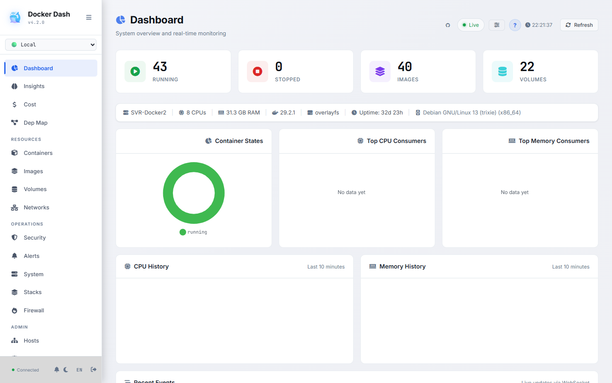
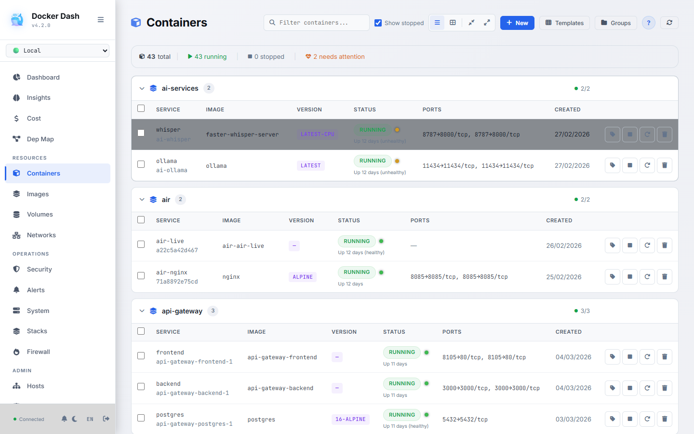
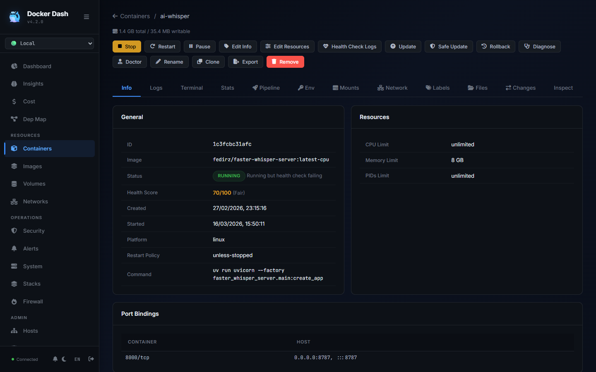
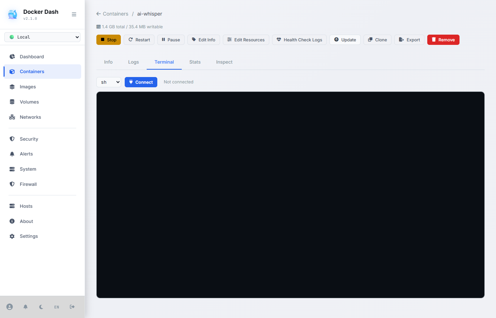
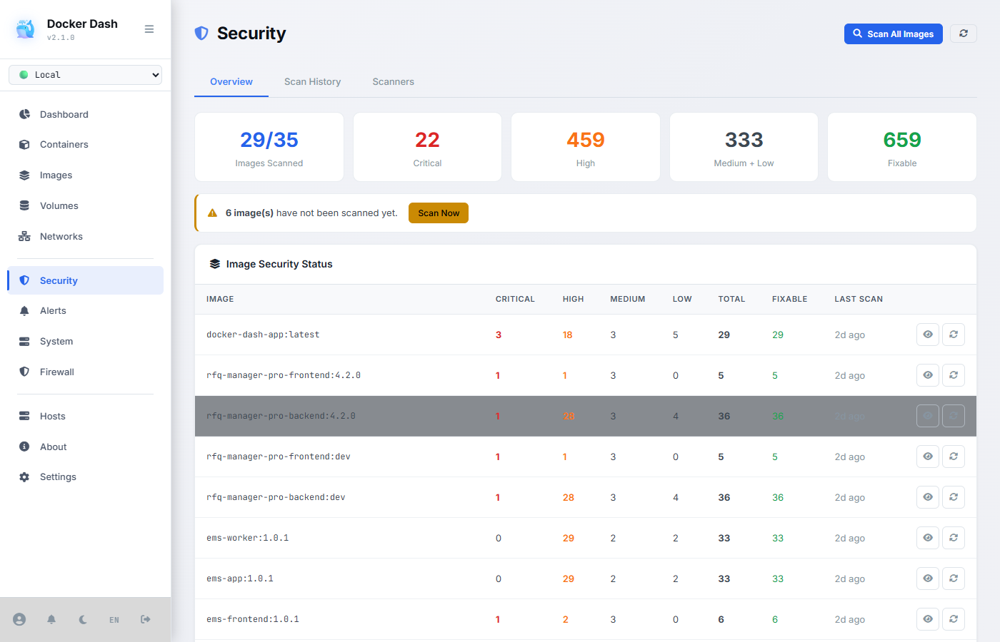
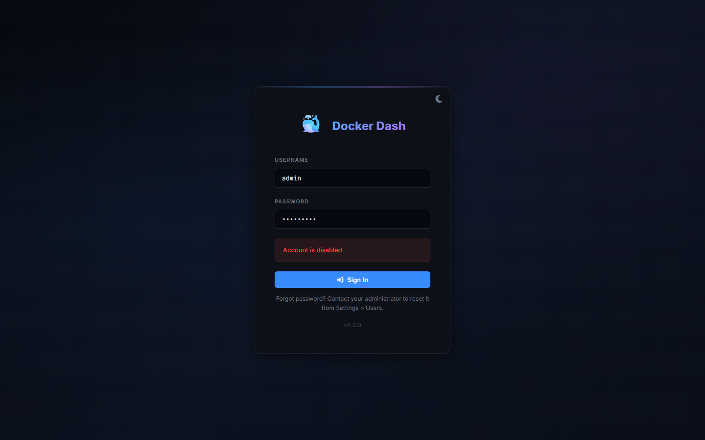
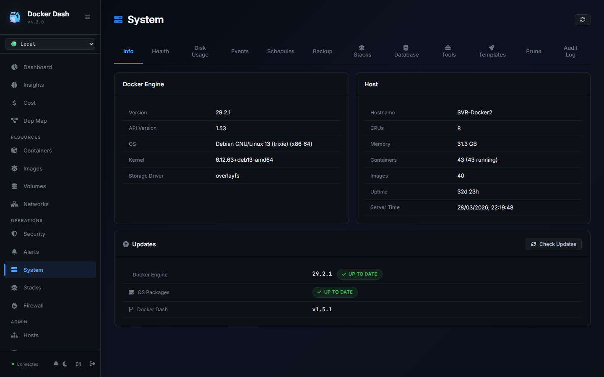
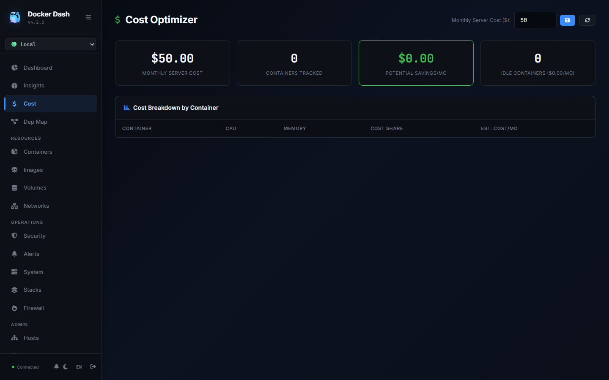
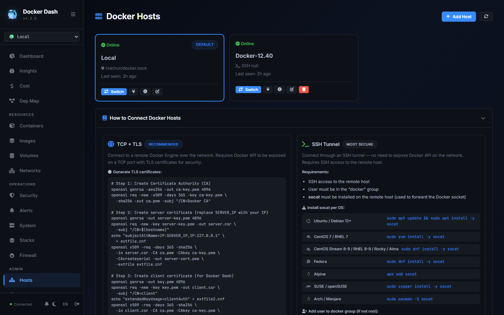

<p align="center">
  <h1 align="center">🐳 Docker Dash</h1>
  <p align="center">
    A lightweight, full-featured Docker management dashboard.<br>
    Self-hosted alternative to Portainer — built with Node.js, vanilla JavaScript, and SQLite.
  </p>
  <p align="center">
    <a href="https://github.com/bogdanpricop/docker-dash/actions/workflows/ci.yml"></a>
    <a href="https://github.com/bogdanpricop/docker-dash/releases/latest"></a>
    <a href="LICENSE"></a>
    <a href="https://github.com/bogdanpricop/docker-dash/actions/workflows/ci.yml"></a>
    <a href="SECURITY.md#security-audit-history"></a>
    <a href="SECURITY.md"></a>
    
    
  </p>
  <p align="center">
    <a href="#quick-start">Quick Start</a> &bull;
    <a href="#features">Features</a> &bull;
    <a href="#screenshots">Screenshots</a> &bull;
    <a href="#comparison">Comparison</a> &bull;
    <a href="#multi-host">Multi-Host</a> &bull;
    <a href="#contributing">Contributing</a>
  </p>
</p>

**Zero dependencies to deploy** — just Docker. No external database, no Redis, no build step.

## Screenshots

<table>
  <tr>
    <td align="center"><strong>Dashboard (Dark)</strong><br></td>
    <td align="center"><strong>Dashboard (Light)</strong><br></td>
  </tr>
  <tr>
    <td align="center"><strong>Containers</strong><br></td>
    <td align="center"><strong>Containers (Light)</strong><br></td>
  </tr>
  <tr>
    <td align="center"><strong>Container Detail</strong><br></td>
    <td align="center"><strong>Terminal (xterm.js)</strong><br></td>
  </tr>
  <tr>
    <td align="center"><strong>Security Scanning</strong><br></td>
    <td align="center"><strong>Image Management</strong><br></td>
  </tr>
  <tr>
    <td align="center"><strong>Network Topology</strong><br></td>
    <td align="center"><strong>Dependency Map</strong><br></td>
  </tr>
  <tr>
    <td align="center"><strong>Cost Optimizer</strong><br></td>
    <td align="center"><strong>Insights</strong><br></td>
  </tr>
  <tr>
    <td align="center"><strong>Stacks</strong><br></td>
    <td align="center"><strong>Multi-Host</strong><br></td>
  </tr>
  <tr>
    <td align="center"><strong>API Playground</strong><br></td>
    <td align="center"><strong>Notifications</strong><br></td>
  </tr>
</table>

## Features

### Core
- **Container Management** — Start, stop, restart, pause, kill, remove, clone, rename, update/recreate
- **Image Management** — Pull with streaming progress, remove, tag, import/export, build from Dockerfile
- **Volume Management** — Create, remove, inspect with real disk usage sizes
- **Network Management** — Create, remove, connect/disconnect containers, inspect IPAM config
- **Bulk Actions** — Checkbox selection + floating bar for batch start/stop/restart/remove
- **Container File Browser** — Navigate, view, and download files inside running containers
- **Container Diff** — See filesystem changes vs base image with color-coded entries

### Monitoring & Intelligence
- **Real-time Dashboard** — Customizable live CPU/memory charts (WebSocket, 10s interval, toggle widgets)
- **Container Health Score** — Composite 0-100 score with color dots in list view + summary bar
- **Resource Trends & Forecasting** — 7-day linear regression with 24h CPU/memory projection
- **Memory Exhaustion Prediction** — "will exceed limit in N hours" warning
- **Plain-English Status** — Exit codes mapped to messages (137=OOM, 143=SIGTERM, etc.)
- **Network Topology** — Interactive canvas map with drag, zoom, pan, hover highlighting
- **Dependency Map** — Interactive graph showing container relationships (env vars, networks, links)
- **Uptime Reports** — Per-container uptime %, restart count, first/last seen
- **Cost Optimizer** — Per-container cost breakdown, idle detection, savings recommendations
- **Image Freshness Dashboard** — Freshness score based on age + vulnerability count
- **Audit Log Analytics** — Top users, top actions, activity heatmap by hour/day
- **Notifications Center** — Dedicated page with filters, pagination, bulk mark-read/delete

### Security
- **Vulnerability Scanning** — Trivy + Grype + Docker Scout with automatic detection and fallback
- **Safe-Pull Updates** — Pull new image → scan for vulns → only swap if clean (blocks critical CVEs)
- **Deployment Pipelines** — Staged pull → scan → swap → verify → notify with full history
- **Security Dashboard** — Scan history, per-image status, AI-assisted remediation prompts
- **AI Container Doctor** — Diagnostics + 30 log pattern matchers + AI prompt generator
- **Guided Troubleshooting** — 8-step diagnostic wizard (state, health, logs, ports, volumes, resources)
- **Container Rollback** — One-click revert to previous image with version history
- **First-login Setup Wizard** — Forces password change, recommends disabling default admin

### Git Integration (GitOps)
- **Deploy from Git** — Clone repos, select branch, compose file path, deploy with one click
- **Auto-Deploy** — Webhook receiver (GitHub, GitLab, Gitea, Bitbucket) + polling-based updates
- **Deployment History** — Full audit trail with commit hash, trigger type, duration, rollback
- **Diff View** — See exactly what changed before redeploying
- **Push to Git** — Edit compose in UI, commit and push back to repository
- **Git Credentials** — Token, basic auth, SSH key (AES-256-GCM encrypted)
- **Multi-file Compose** — Multiple YAML override files per stack
- **Environment Overrides** — Per-stack env vars with sensitive value encryption

### Multi-Host
- **TCP + TLS** — Connect remote Docker hosts over the network with mutual TLS
- **SSH Tunnel** — Secure tunnel via SSH (no need to expose Docker API)
- **Docker Desktop** — Connect to Windows/Mac Docker Desktop instances
- **Host Selector** — Switch between hosts from the sidebar dropdown

### Operations
- **Stacks Page** — Unified Compose + Git stacks management with actions (up/down/restart/pull)
- **Docker Compose Editor** — Edit, validate, save & deploy compose configs inline
- **Terminal** — Full xterm.js terminal with shell selection (`sh`, `bash`, `zsh`, `ash`)
- **Alerts** — CPU/memory threshold rules with 7 notification channels
- **Notifications** — Discord, Slack, Telegram, Ntfy, Gotify, Email (SMTP), Custom Webhook
- **Workflow Automation** — IF-THEN rules (CPU high → restart, container crash → notify, etc.)
- **Scheduled Actions** — Cron-based container actions with presets, history, run-now, enable/disable
- **Maintenance Windows** — Scheduled pull/scan/update with block-on-critical
- **Firewall** — View and manage UFW rules (Linux)
- **Container Groups** — User-defined grouping with colors, beyond Docker Compose projects

### Developer Tools
- **API Playground** — Browse and test all 230+ API endpoints from the UI with response viewer
- **docker run → Compose** — Paste any docker run command, get docker-compose YAML
- **AI Log Analysis** — Generate diagnostic prompts for ChatGPT/Claude from container logs
- **Traefik/Caddy Labels** — Generate reverse proxy labels from domain + port
- **App Templates** — 30 built-in + custom templates with CRUD, preview, and modification tracking
- **Deploy Preview** — Check for image updates via digest comparison before pulling
- **Resource Limits Editor** — Visual sliders with presets for CPU and memory
- **Resource Recommendations** — Smart advice: over-provisioned, memory pressure, idle containers

### Platform
- **Multi-user** — Admin, operator, viewer roles with session management
- **SSO Authentication** — Authelia, Authentik, Caddy forward_auth, Traefik (header-based)
- **Audit Log** — Every action logged with user, timestamp, IP address
- **Public Status Page** — Unauthenticated status page for selected services
- **Container Metadata** — Custom labels, descriptions, links, categories, owner, notes
- **Dark/Light Theme** — Per-user sync across devices, system-aware toggle, mobile responsive
- **i18n** — 11 languages: English, Romanian, German, Italian, French, Spanish, Portuguese, Chinese, Japanese, Korean, Klingon ([add yours](public/js/i18n/README.md))
- **Klingon Easter Egg** — Full activation animation with sound, dagger cursor, red theme
- **Command Palette** — Ctrl+K quick navigation with keyboard shortcuts
- **Watchtower Detection** — Auto-detect and migrate from Watchtower to native safe-pull
- **Prometheus Metrics** — `/api/metrics` endpoint for Grafana integration
- **Self-Reporting Footprint** — Docker Dash memory, uptime, DB size at `/api/footprint`
- **335 Tests** — 22 test suites covering auth, RBAC, security, CRUD, services (100% passing)

## Quick Start

```bash
# Clone the repository
git clone https://github.com/bogdanpricop/docker-dash.git
cd docker-dash

# Copy and configure environment
cp .env.example .env
# Edit .env — at minimum change APP_SECRET and ADMIN_PASSWORD

# Start with Docker Compose
docker compose up -d

# Open in browser
open http://localhost:8101
```

Default credentials: `admin` / `admin` — on first login, a **security setup wizard** will require you to change the password.

## Requirements

- Docker Engine 20.10+ (or Docker Desktop 4.x+)
- Docker Compose v2
- ~50MB RAM, minimal CPU

## Architecture

```
┌─────────────────┐     ┌───────────────────┐
│   Browser SPA   │────▸│  Node.js/Express  │
│  (vanilla JS)   │◂────│   REST + WebSocket│
└─────────────────┘     └────────┬──────────┘
                                 │
                    ┌────────────┼────────────┐
                    │            │            │
              ┌─────┴──────┐ ┌───┴────┐ ┌─────┴─────┐
              │  SQLite    │ │ Docker │ │  Docker   │
              │ (embedded) │ │ Local  │ │  Remote   │
              │ WAL mode   │ │ Socket │ │ TCP/SSH   │
              └────────────┘ └────────┘ └───────────┘
```

| Layer | Technology |
|-------|-----------|
| Backend | Node.js 20, Express 4, dockerode, better-sqlite3, ws, ssh2 |
| Frontend | Vanilla JavaScript SPA, Chart.js, xterm.js, Font Awesome (CDN) |
| Database | SQLite with WAL mode, auto-aggregation, configurable retention |
| Security | bcrypt, Helmet CSP, rate limiting, session-based auth, Bearer token fallback |
| Scanning | Trivy (OSS), Grype (Anchore), Docker Scout (SARIF format) |

**Zero build step** — no webpack, no bundler, no transpiler. Frontend files are served as-is.

## Multi-Host

Docker Dash can manage multiple Docker hosts from a single instance:

| Method | Use Case | Requirements |
|--------|----------|-------------|
| **TCP + TLS** | Remote Linux servers | Docker API exposed on port 2376 + TLS certificates |
| **Docker Desktop** | Windows / Mac | "Expose daemon on TCP" enabled in DD Settings |
| **SSH Tunnel** | Secure remote (no API exposure) | SSH access + `socat` installed + user in `docker` group |
| **Unix Socket** | Local (default) | Docker socket mounted (automatic) |

The app includes a **built-in setup guide** (Hosts page) with step-by-step instructions for each method, including TLS certificate generation and per-OS `socat` installation commands.

## Configuration

All config via environment variables. See [`.env.example`](.env.example) for the full list.

| Variable | Default | Description |
|----------|---------|-------------|
| `APP_PORT` | `8101` | HTTP port |
| `APP_SECRET` | — | **Required.** Session signing key |
| `ADMIN_PASSWORD` | `admin` | Initial admin password (first launch only) |
| `ENCRYPTION_KEY` | — | Encrypt registry credentials at rest |
| `STATS_INTERVAL_MS` | `10000` | Stats collection interval (ms) |
| `STATS_RAW_RETENTION_HOURS` | `24` | Keep raw stats for N hours |
| `EVENT_RETENTION_DAYS` | `7` | Keep Docker events for N days |
| `ENABLE_EXEC` | `true` | Allow terminal exec into containers |
| `READ_ONLY_MODE` | `false` | Disable all write operations |

## Development

```bash
# Install dependencies
npm install

# Start in development mode (auto-reload on file changes)
npm run dev

# Open http://localhost:8101
```

No build step needed. Edit any `.js` or `.css` file and refresh the browser.

## Adding a Language

Docker Dash uses a modular i18n system. To add a new language:

1. Copy `public/js/i18n/TEMPLATE.js` to `public/js/i18n/{code}.js`
2. Translate the values (keys stay in English)
3. Add one `<script>` tag in `index.html`

That's it — the language appears automatically in the selector. See [`public/js/i18n/README.md`](public/js/i18n/README.md) for full instructions.

Currently supported: **English**, **Romanian**, **German**.

## Project Structure

```
docker-dash/
├── src/
│   ├── config/          # Environment-based configuration
│   ├── db/              # SQLite setup + 13 auto-migrations
│   ├── middleware/       # Auth, rate limiting, hostId extraction
│   ├── routes/          # REST API (containers, images, volumes, networks, hosts, ...)
│   ├── services/        # Business logic (docker, stats, alerts, ssh-tunnel, registry)
│   ├── ws/              # WebSocket server (exec, live logs, live stats)
│   └── utils/           # Logger, helpers
├── public/
│   ├── js/
│   │   ├── i18n/        # Language files (11 languages + TEMPLATE.js)
│   │   ├── pages/       # SPA pages (dashboard, containers, images, security, hosts, ...)
│   │   ├── components/  # Reusable UI (modal, toast, data table)
│   │   ├── api.js       # HTTP client with auto host-context
│   │   ├── ws.js        # WebSocket client with reconnect
│   │   └── app.js       # Router, auth, sidebar, command palette
│   └── css/app.css      # Single stylesheet, CSS variables, dark/light themes
├── docs/
│   └── screenshots/     # UI screenshots for README
├── Dockerfile           # Multi-stage: base → deps → production
├── docker-compose.yml   # Production-ready with health check
└── .env.example         # All variables documented
```

## Comparison

**75+ features compared, 40+ exclusive to Docker Dash.** See the interactive comparison at `#/compare` in the app, or via `GET /api/compare`.

| Feature | Docker Dash | Portainer CE | Dockge | Dockhand |
|---------|:-----------:|:------------:|:------:|:--------:|
| Container CRUD | Yes | Yes | Compose only | Yes |
| Image Management | Yes | Yes | No | Yes |
| Volume / Network Management | Yes | Yes | No | Yes |
| **Network Topology** | **Yes** | No | No | No |
| **Dependency Map** | **Yes** | No | No | No |
| Real-time Stats (WebSocket) | Yes | Yes | Basic | Yes |
| Terminal (xterm.js) | Yes | Yes | Yes | Yes |
| **Container File Browser** | **Yes** | Yes ($) | No | No |
| **Container Diff** | **Yes** | No | No | No |
| Vulnerability Scanning | Trivy + Grype + Scout | No | No | Grype + Trivy |
| **Safe-Pull + Pipeline** | **5-stage** | No | No | Basic |
| **Container Rollback** | **Yes** | No | No | No |
| Multi-Host (agentless) | Yes | Agent required | Agent | Yes |
| **Git Integration** | **Yes** | BE only ($) | No | No |
| **Webhooks + Polling** | **Yes** | BE only ($) | No | No |
| **Audit Log** | **Yes** | BE only ($) | No | No |
| **Alerts (7 channels)** | **Yes** | BE only ($) | No | No |
| **SSO (Authelia/Authentik)** | **Yes** | BE only ($) | No | No |
| **Health Score (0-100)** | **Yes** | No | No | No |
| **AI Container Doctor** | **Yes** | No | No | No |
| **Resource Forecasting** | **Yes** | No | No | No |
| **Cost Optimizer** | **Yes** | No | No | No |
| **Insights Dashboard** | **Yes** | No | No | No |
| **Workflow Automation** | **Yes** | No | No | No |
| **Scheduled Actions (cron)** | **Yes** | No | No | No |
| **Bulk Actions** | **Yes** | Yes | No | No |
| **Cross-Host Migration** | **Zero-downtime** | No | No | No |
| **Stack Export/Import** | **Yes** | No | No | No |
| **Compose Editor** | **Yes** | Yes ($) | Yes | No |
| **Troubleshooting Wizard** | **Yes** | No | No | No |
| **Public Status Page** | **Yes** | No | No | No |
| **Daily Auto-Backup** | **Yes** | No | No | No |
| **Notifications Center** | **Yes** | Basic | No | No |
| **API Playground** | **Yes** | Swagger ($) | No | No |
| **Container Groups** | **Yes** | No | No | No |
| **Dashboard Widgets** | **Configurable** | Fixed | No | No |
| App Templates | 30 + custom | 500+ community | No | No |
| i18n | 11 languages | Partial | No | No |
| Command Palette + Shortcuts | Yes | No | No | No |
| Mobile Responsive | Yes | Yes | Yes | Yes |
| Test Suite | 384 tests (100%) | Yes | No | No |
| Build Step | **None** | Angular | Required | Required |
| Container Size | **~80MB** | ~250MB | ~100MB | ~80MB |
| RAM Usage | **~50MB** | ~200MB | ~50MB | ~60MB |
| License | **MIT** | Zlib | MIT | BSL 1.1 |

> **40+ features** are exclusive to Docker Dash — no competitor has them.
> **6 features** that Portainer locks behind paid Business Edition are **free** in Docker Dash.

## License

[MIT](LICENSE) — free for personal and commercial use.

## Security

Docker Dash takes security seriously. See [SECURITY.md](SECURITY.md) for our full security policy.

### Docker Socket Access

Docker Dash requires access to the Docker socket (`/var/run/docker.sock`). This is **equivalent to root access** on the host. This is the same requirement as Portainer, Dockge, and all other Docker management UIs.

**Mitigations in place:**
- Socket mounted **read-only** (`:ro`) in production docker-compose
- `no-new-privileges` security option enabled
- Role-based access control (admin/operator/viewer)
- Feature flags to disable dangerous operations (`ENABLE_EXEC=false`, `READ_ONLY_MODE=true`)
- Audit log for every action with user, timestamp, and IP
- Rate limiting on all API endpoints
- Session-based auth with bcrypt + SHA-256 hashed tokens

**Recommendations for production:**
- Deploy behind HTTPS reverse proxy (Caddy config included)
- Set strong `APP_SECRET` and `ENCRYPTION_KEY` (app refuses to start without them)
- Set `COOKIE_SECURE=true` when behind HTTPS
- Disable exec terminal if not needed (`ENABLE_EXEC=false`)
- Use read-only mode for monitoring-only deployments (`READ_ONLY_MODE=true`)
- Restrict network access to trusted IPs
- Consider [docker-socket-proxy](https://github.com/Tecnativa/docker-socket-proxy) to limit API access (allow only read operations)
- Review [SECURITY.md](SECURITY.md) for responsible disclosure process

### Security Audit Results

| Audit | Date | Score | Critical Issues |
|-------|------|-------|----------------|
| Tech Debt Scan | 2026-03-27 | 33 items found | All 4 CRITICAL fixed |
| Production Readiness | 2026-03-28 | 9.2/10 | All P0+P1 resolved |
| Shell Injection | 2026-03-28 | 0 vectors | All execSync eliminated |

### Known Security Tradeoffs

These are conscious design decisions documented in [SECURITY.md](SECURITY.md):

1. **CSP allows `unsafe-inline`/`unsafe-eval`** — required by the zero-build-step vanilla JS architecture. XSS is mitigated by output escaping on all user content.
2. **WebSocket accepts token via query string** — fallback for browsers that block cookies (Edge Tracking Prevention). Cookie-based auth is always preferred. Usage is logged.
3. **Mixed auth model (cookie + Bearer + API key)** — cookies for browser UI, Bearer for API/CLI, API keys for integrations. All validate against the same session store.

### Test Coverage

- **384 tests** across 29 test files (100% passing)
- Unit tests: crypto, helpers, validation, git patterns
- Integration tests: auth flow, API endpoints
- CI runs on every push via GitHub Actions

## Contributing

Contributions are welcome! See [CONTRIBUTING.md](CONTRIBUTING.md) for:
- Development setup
- Architecture principles (no build step, no framework)
- How to add pages, API endpoints, database migrations
- How to add a language translation
- Pull request checklist

## Acknowledgments

Built with:
- [dockerode](https://github.com/apocas/dockerode) — Docker API client
- [better-sqlite3](https://github.com/WiseLibs/better-sqlite3) — SQLite driver
- [xterm.js](https://xtermjs.org/) — Terminal emulator
- [Chart.js](https://www.chartjs.org/) — Charts
- [Trivy](https://trivy.dev/) — Vulnerability scanner
- [Grype](https://github.com/anchore/grype) — Vulnerability scanner by Anchore
- [ssh2](https://github.com/mscdex/ssh2) — SSH client
- [Font Awesome](https://fontawesome.com/) — Icons
